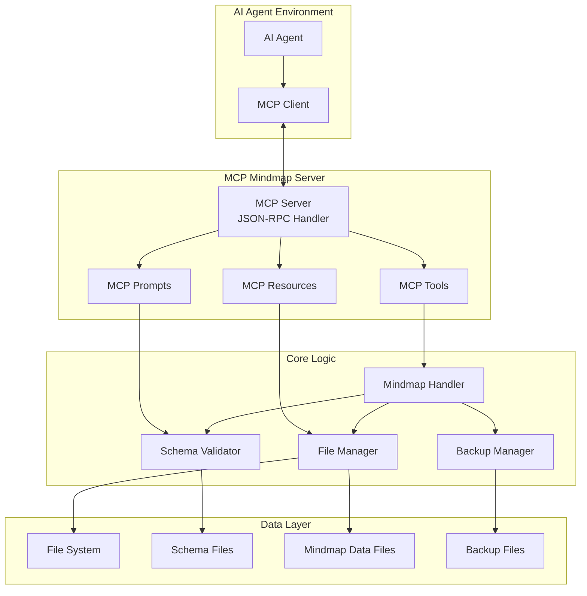

# 設計書

## 概要

AI AgentがModel Context Protocol（MCP）を通じてマインドマップを理解し、操作するためのシステム設計。このシステムは、既存のマインドマップアプリケーションのデータ構造とスキーマを活用し、MCPサーバーとして動作するツールセットを提供する。

## アーキテクチャ

### MCP準拠システム構成



### MCP準拠設計原則

1. **Tools**: 具体的な操作を実行する関数として実装
2. **Resources**: マインドマップファイルとスキーマをリソースとして公開
3. **Prompts**: マインドマップ操作のためのプロンプトテンプレートを提供
4. **JSON-RPC**: 標準的なMCP通信プロトコルを使用

## MCP コンポーネント設計

### MCP Tools（ツール）
AI Agentが呼び出し可能な具体的な操作関数

#### Core Handler Classes
```typescript
class MindmapHandler {
  async loadMindmap(filePath: string): Promise<MindmapData>;
  async saveMindmap(filePath: string, data: MindmapData): Promise<void>;
  async addNode(filePath: string, parentId: string, nodeData: Partial<MindmapNode>): Promise<string>;
  async updateNode(filePath: string, nodeId: string, updates: Partial<MindmapNode>): Promise<void>;
  async deleteNode(filePath: string, nodeId: string, cascade: boolean): Promise<string[]>;
  async searchNodes(filePath: string, query: SearchQuery): Promise<MindmapNode[]>;
  async analyzeMindmap(filePath: string): Promise<MindmapAnalysis>;
}

class SchemaValidator {
  async validateMindmap(data: unknown): Promise<ValidationResult>;
  async getSchema(): Promise<JSONSchema>;
  async getCustomSchema(filePath: string): Promise<CustomSchema | null>;
}

class BackupManager {
  async createBackup(filePath: string, description?: string): Promise<BackupInfo>;
  async restoreBackup(backupId: string, targetPath: string): Promise<void>;
  async listBackups(filePath: string): Promise<BackupInfo[]>;
  async deleteBackup(backupId: string): Promise<void>;
}
```

### MCP Resources（リソース）
AI Agentがアクセス可能なデータリソース

#### Resource Types
```typescript
interface MindmapResource {
  uri: string;
  name: string;
  description: string;
  mimeType: string;
}

// 例: mindmap://path/to/file.json
// 例: schema://mindmap-data.schema.json
// 例: backup://backup-id-123
```

### MCP Prompts（プロンプト）
マインドマップ操作のためのプロンプトテンプレート

#### Prompt Templates
```typescript
interface MindmapPrompts {
  "analyze-mindmap": {
    name: "マインドマップ分析";
    description: "マインドマップの構造と品質を分析";
    arguments: [
      {
        name: "file_path";
        description: "分析対象のマインドマップファイルパス";
        required: true;
      }
    ];
  };
  
  "suggest-improvements": {
    name: "改善提案";
    description: "マインドマップの改善点を提案";
    arguments: [
      {
        name: "analysis_result";
        description: "分析結果データ";
        required: true;
      }
    ];
  };
  
  "create-node-structure": {
    name: "ノード構造作成";
    description: "指定されたトピックに基づいてノード構造を提案";
    arguments: [
      {
        name: "topic";
        description: "作成したいマインドマップのトピック";
        required: true;
      },
      {
        name: "depth";
        description: "作成する階層の深さ";
        required: false;
      }
    ];
  };
}

### MCP Tools 実装仕様

#### Tool Registration
```typescript
const tools: MCPTool[] = [
  {
    name: "get_mindmap_schema",
    description: "マインドマップのJSONスキーマとカスタムスキーマ情報を取得",
    inputSchema: {
      type: "object",
      properties: {
        include_custom: { type: "boolean", description: "カスタムスキーマを含めるか" },
        file_path: { type: "string", description: "特定ファイルのカスタムスキーマパス" }
      }
    }
  },
  
  {
    name: "read_mindmap",
    description: "マインドマップファイルを読み込んでデータを取得",
    inputSchema: {
      type: "object",
      properties: {
        file_path: { type: "string", required: true, description: "マインドマップファイルパス" },
        include_metadata: { type: "boolean", description: "メタデータを含めるか" }
      },
      required: ["file_path"]
    }
  },
  
  {
    name: "search_nodes",
    description: "マインドマップ内のノードを検索・フィルタリング",
    inputSchema: {
      type: "object",
      properties: {
        file_path: { type: "string", required: true },
        query: { type: "string", description: "検索キーワード" },
        filters: { 
          type: "object",
          properties: {
            node_type: { type: "string" },
            status: { type: "array", items: { type: "string" } },
            priority: { type: "array", items: { type: "string" } },
            tags: { type: "array", items: { type: "string" } }
          }
        },
        max_results: { type: "number", default: 100 }
      },
      required: ["file_path"]
    }
  },
  
  {
    name: "add_node",
    description: "マインドマップに新しいノードを追加",
    inputSchema: {
      type: "object",
      properties: {
        file_path: { type: "string", required: true },
        parent_id: { type: "string", required: true },
        node_data: {
          type: "object",
          properties: {
            title: { type: "string", required: true },
            description: { type: "string" },
            type: { type: "string" },
            priority: { type: "string", enum: ["high", "medium", "low"] },
            status: { type: "string", enum: ["todo", "in-progress", "done", "blocked"] }
          },
          required: ["title"]
        },
        auto_save: { type: "boolean", default: true }
      },
      required: ["file_path", "parent_id", "node_data"]
    }
  },
  
  {
    name: "update_node",
    description: "既存のマインドマップノードを更新",
    inputSchema: {
      type: "object",
      properties: {
        file_path: { type: "string", required: true },
        node_id: { type: "string", required: true },
        updates: { type: "object" },
        auto_save: { type: "boolean", default: true }
      },
      required: ["file_path", "node_id", "updates"]
    }
  },
  
  {
    name: "delete_node",
    description: "マインドマップからノードを削除",
    inputSchema: {
      type: "object",
      properties: {
        file_path: { type: "string", required: true },
        node_id: { type: "string", required: true },
        cascade: { type: "boolean", default: true, description: "子ノードも削除するか" },
        auto_save: { type: "boolean", default: true }
      },
      required: ["file_path", "node_id"]
    }
  },
  
  {
    name: "analyze_mindmap",
    description: "マインドマップの構造と品質を分析",
    inputSchema: {
      type: "object",
      properties: {
        file_path: { type: "string", required: true },
        analysis_type: { 
          type: "string", 
          enum: ["structure", "quality", "completeness", "all"],
          default: "all"
        }
      },
      required: ["file_path"]
    }
  },
  
  {
    name: "create_backup",
    description: "マインドマップのバックアップを作成",
    inputSchema: {
      type: "object",
      properties: {
        file_path: { type: "string", required: true },
        description: { type: "string", description: "バックアップの説明" }
      },
      required: ["file_path"]
    }
  },
  
  {
    name: "restore_backup",
    description: "バックアップからマインドマップを復元",
    inputSchema: {
      type: "object",
      properties: {
        backup_id: { type: "string", required: true },
        target_path: { type: "string", required: true }
      },
      required: ["backup_id", "target_path"]
    }
  }
];
```

## データモデル

### 拡張データ型

#### SearchQuery
```typescript
interface SearchQuery {
  text?: string;
  node_type?: string;
  status?: string[];
  priority?: string[];
  tags?: string[];
  date_range?: {
    field: 'createdAt' | 'updatedAt' | 'deadline';
    start?: string;
    end?: string;
  };
  custom_fields?: Record<string, unknown>;
}
```

#### MindmapAnalysis
```typescript
interface MindmapAnalysis {
  statistics: {
    total_nodes: number;
    max_depth: number;
    avg_children_per_node: number;
    node_types: Record<string, number>;
    status_distribution: Record<string, number>;
  };
  structure_issues: {
    orphaned_nodes: string[];
    circular_references: string[];
    inconsistent_relationships: string[];
    missing_required_fields: Array<{
      node_id: string;
      missing_fields: string[];
    }>;
  };
  recommendations: string[];
  quality_metrics: {
    completeness_score: number;
    consistency_score: number;
    structure_score: number;
    overall_score: number;
  };
}
```

#### OperationResult
```typescript
interface OperationResult {
  success: boolean;
  message: string;
  data?: unknown;
  errors?: ValidationError[];
  warnings?: string[];
  affected_nodes?: string[];
}
```

#### BackupInfo
```typescript
interface BackupInfo {
  id: string;
  file_path: string;
  backup_path: string;
  created_at: string;
  description?: string;
  file_size: number;
  checksum: string;
}
```

## エラーハンドリング

### エラー分類

1. **Validation Errors**: スキーマ違反やデータ不整合
2. **File System Errors**: ファイル読み書きエラー
3. **Structure Errors**: マインドマップ構造の問題
4. **Permission Errors**: アクセス権限エラー
5. **Network Errors**: 外部リソースアクセスエラー

### エラーレスポンス形式

```typescript
interface MCPError {
  code: string;
  message: string;
  details?: {
    file_path?: string;
    node_id?: string;
    validation_errors?: ValidationError[];
    suggestions?: string[];
  };
  severity: 'error' | 'warning' | 'info';
}
```

### エラー処理戦略

- **Graceful Degradation**: 部分的な失敗でも可能な操作は継続
- **Rollback Support**: 失敗時の状態復元機能
- **Detailed Logging**: 詳細なエラーログとトレース情報
- **User-Friendly Messages**: 日本語での分かりやすいエラーメッセージ

## テスト戦略

### テストレベル

1. **Unit Tests**: 各サービスクラスの単体テスト
2. **Integration Tests**: MCPサーバーとサービス間の統合テスト
3. **End-to-End Tests**: AI Agentからの実際の操作テスト
4. **Performance Tests**: 大規模マインドマップでの性能テスト

### テストデータ

- **Minimal Mindmap**: 最小構成のテストデータ
- **Complex Mindmap**: 複雑な階層構造を持つテストデータ
- **Invalid Data**: バリデーションエラーを発生させるデータ
- **Edge Cases**: 境界値や特殊ケースのテストデータ

### モックとスタブ

- **File System Mock**: ファイル操作のモック
- **Schema Validation Stub**: バリデーション結果のスタブ
- **MCP Client Mock**: AI Agentからの要求をシミュレート

## セキュリティ考慮事項

### Security Implementation
MCPツール実行時のセキュリティ機能

**実装方針:**
- 各ツール実行前のパス検証
- 入力パラメータのサニタイゼーション
- ツール実行ログの記録
- ファイルアクセス権限の確認

### アクセス制御

- **File Path Validation**: パストラバーサル攻撃の防止
- **Permission Checks**: ファイルアクセス権限の確認
- **Input Sanitization**: 入力データのサニタイゼーション
- **Operation Authorization**: 操作権限の確認

### データ保護

- **Backup Encryption**: バックアップファイルの暗号化
- **Sensitive Data Handling**: 機密情報の適切な処理
- **Audit Logging**: 操作履歴の記録
- **Data Masking**: 機密データのマスキング

### 脆弱性対策

- **Injection Prevention**: インジェクション攻撃の防止
- **Resource Limits**: リソース使用量の制限
- **Error Information Leakage**: エラー情報の漏洩防止
- **Rate Limiting**: API呼び出し頻度の制限

## パフォーマンス最適化

### MCP Server Implementation

#### Server Configuration
```typescript
interface MCPServerConfig {
  name: "mindmap-agent";
  version: "1.0.0";
  capabilities: {
    tools: true;
    resources: true;
    prompts: true;
    logging: true;
  };
  transport: {
    type: "stdio" | "websocket";
    options?: {
      port?: number;
      host?: string;
    };
  };
}
```

#### Performance Optimization
大規模マインドマップの効率的な処理機能

**実装方針:**
- ツール実行時のキャッシュ機能
- バッチ処理対応のツール設計
- ストリーミング処理によるメモリ効率化
- リソース監視とエラーハンドリング

### キャッシュ戦略

- **Schema Caching**: スキーマ情報のメモリキャッシュ
- **File Content Caching**: 頻繁にアクセスされるファイルのキャッシュ
- **Validation Result Caching**: バリデーション結果のキャッシュ
- **Query Result Caching**: 検索結果のキャッシュ

### 非同期処理

- **Async File Operations**: ファイル操作の非同期化
- **Batch Processing**: 複数操作のバッチ処理
- **Background Tasks**: バックアップなどのバックグラウンド処理
- **Resource Monitoring**: リソース使用量の監視

### メモリ管理

- **Streaming Processing**: 大きなファイルのストリーミング処理
- **Memory Pool**: オブジェクトプールによるメモリ効率化
- **Garbage Collection**: 適切なメモリ解放
- **Resource Limits**: メモリ使用量の制限

## 拡張性設計

### Extension Implementation
MCPサーバーの拡張機能

**実装方針:**
- 動的ツール登録機能
- カスタムバリデーターの追加
- 多言語メッセージ対応
- バージョン互換性の管理

### プラグインアーキテクチャ

- **Custom Validators**: カスタムバリデーターの追加
- **Export Formats**: 新しいエクスポート形式の対応
- **Analysis Plugins**: 分析機能の拡張
- **Plugin Registry**: プラグインの登録と管理

### API バージョニング

- **Backward Compatibility**: 下位互換性の維持
- **Version Negotiation**: バージョン交渉機能
- **Migration Support**: データ移行サポート
- **Deprecation Management**: 非推奨機能の管理

### 国際化対応

- **Message Localization**: エラーメッセージの多言語化
- **Date/Time Formatting**: 地域に応じた日時形式
- **Number Formatting**: 数値形式の地域対応
- **Locale Detection**: 自動言語検出

### Resource Implementation

#### Resource Types
```typescript
const resources: MCPResource[] = [
  {
    uri: "mindmap://schema/base",
    name: "Base Mindmap Schema",
    description: "基本マインドマップのJSONスキーマ",
    mimeType: "application/json"
  },
  
  {
    uri: "mindmap://files/{path}",
    name: "Mindmap File",
    description: "マインドマップデータファイル",
    mimeType: "application/json"
  },
  
  {
    uri: "mindmap://backups/{id}",
    name: "Backup File",
    description: "バックアップファイル",
    mimeType: "application/json"
  }
];
```

### Error Handling

#### MCP Error Response
```typescript
interface MCPErrorResponse {
  error: {
    code: number;
    message: string;
    data?: {
      type: string;
      details: unknown;
      suggestions?: string[];
    };
  };
}

// エラーコード定義
const ERROR_CODES = {
  INVALID_PARAMS: -32602,
  INTERNAL_ERROR: -32603,
  FILE_NOT_FOUND: -32001,
  VALIDATION_ERROR: -32002,
  PERMISSION_DENIED: -32003,
  RESOURCE_LIMIT: -32004
} as const;
```