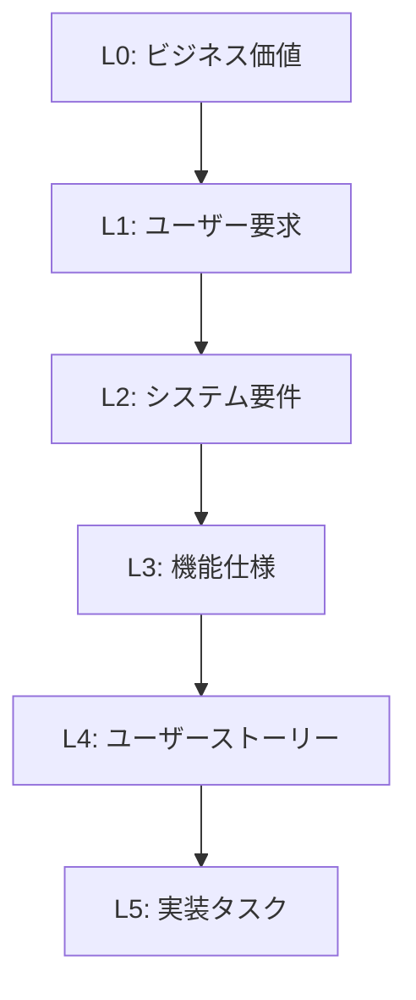

# 統合要件定義マインドマップ 使用ガイド

## 概要

統合要件定義マインドマップは、ビジネスニーズから実装タスクまで**要求から実装まで一気通貫**で管理する革新的なアプローチです。従来の分断された要件管理を統合し、完全なトレーサビリティと品質保証を実現します。

## 🎯 特徴

### ✨ 6段階の抽象度レベル
- **L0: ビジネスニーズ** - 戦略的目標、市場機会
- **L1: ステークホルダー要求** - 具体的な要求、期待事項
- **L2: システム要件** - 機能要件、非機能要件
- **L3: 機能仕様** - 詳細設計、技術仕様
- **L4: ユーザーストーリー** - 開発可能な単位
- **L5: 実装タスク** - 具体的な作業項目

### 🔗 完全なトレーサビリティ
- 上位レベルから下位レベルへの**派生関係**
- 下位レベルから上位レベルへの**実現関係**
- 同レベル内での**依存関係・関連関係**
- 変更影響分析の自動化

### 🏗️ 横断的関心事の管理
- **ステークホルダー管理** - 関与レベル、権限、期待事項
- **品質属性** - 性能、セキュリティ、可用性など
- **制約** - 技術制約、予算制約、時間制約
- **リスク** - プロジェクトリスクと対策

### 📊 自動品質保証
- **完全性チェック** - 必須項目の確認
- **整合性チェック** - 論理的矛盾の検出
- **トレーサビリティチェック** - 関連性の検証
- **品質スコア** - 客観的評価指標

## 🚀 使い方

### 1. テンプレートの選択

プロジェクト開始時に統合要件定義テンプレートを選択してください：

```yaml
# プロジェクト作成時
templateType: "unified-requirements"
```

### 2. プロジェクト情報の設定

基本情報を設定します：

```yaml
title: "次世代ECサイト開発"
description: "ユーザー体験を向上させる新しいECプラットフォーム"
abstractionLevels: [0, 1, 2, 3, 4, 5]  # 使用するレベル
```

### 3. ステークホルダーの定義

関係者を明確に定義します：

```yaml
crossCuttingConcerns:
  stakeholders:
    PM001:
      name: "プロダクトマネージャー"
      role: "product_manager"
      influence: "high"
      interest: "high"
      involvementByLevel:
        0: "owner"      # L0の責任者
        1: "reviewer"   # L1のレビュアー
        2: "approver"   # L2の承認者
        # ...
```

### 4. 品質属性の設定

品質要件を明確化します：

```yaml
qualityAttributes:
  PERF001:
    name: "レスポンス性能"
    category: "performance"
    targets:
      - metric: "response_time"
        value: "< 2秒"
        priority: "high"
    applicableLevels: [2, 3, 4, 5]
```

## 📋 レベル別作成手順

### L0: ビジネスニーズの定義

ビジネス価値と戦略的意義を明確化：

```yaml
levelSpecificData:
  level: 0
  businessCase: "年間売上20%向上を目指す"
  roi:
    expectedROI: 150
    paybackPeriod: 18
    investmentAmount: 5000000
  strategicAlignment: 
    - "digital_transformation"
    - "customer_satisfaction"
```

**重要ポイント：**
- ROIを数値で明示
- 戦略的整合性を確認
- 市場機会を分析

### L1: ステークホルダー要求の収集

各ステークホルダーの具体的な要求を整理：

```yaml
levelSpecificData:
  level: 1
  requestor:
    stakeholderId: "PM001"
    name: "プロダクトマネージャー"
  rationale: "ユーザー離脱率の改善が急務"
  impactAnalysis:
    businessImpact: "high"
    technicalImpact: "medium"
    userImpact: "high"
```

**重要ポイント：**
- 要求の背景・理由を明記
- 影響度を多角的に評価
- 受け入れ基準を設定

### L2: システム要件の定義

システムが満たすべき要件を体系化：

```yaml
levelSpecificData:
  level: 2
  requirementType: "functional"
  qualityAttributes: ["PERF001", "SEC001"]
  constraints: ["TECH001"]
  verificationMethod:
    method: "testing"
    details: "性能テストによる検証"
```

**重要ポイント：**
- 機能要件と非機能要件を分離
- 制約を明確化
- 検証方法を定義

### L3: 機能仕様の詳細化

実装可能なレベルまで詳細化：

```yaml
levelSpecificData:
  level: 3
  functionalSpec:
    inputs: ["検索キーワード", "カテゴリ"]
    outputs: ["商品リスト", "検索結果数"]
    processing: "Elasticsearch による高速検索"
  technicalSpec:
    architecture: "マイクロサービス"
    frameworks: ["React", "Spring Boot"]
    databases: ["PostgreSQL", "Elasticsearch"]
```

**重要ポイント：**
- 入出力を明確化
- 技術選択の根拠を記載
- インターフェース仕様を定義

### L4: ユーザーストーリーの作成

開発チームが理解できる形で記述：

```yaml
levelSpecificData:
  level: 4
  userRole: "一般ユーザー"
  userGoal: "商品を素早く検索したい"
  userBenefit: "時間を節約して購入体験を向上させる"
  acceptanceCriteria:
    - id: "AC001"
      description: "キーワード入力で2秒以内に結果表示"
      testable: true
      priority: "high"
```

**重要ポイント：**
- WHY（なぜ）を明確化
- テスト可能な受け入れ基準
- 完了の定義（DoD）を設定

### L5: 実装タスクの分解

具体的な作業レベルまで分解：

```yaml
levelSpecificData:
  level: 5
  taskType: "backend_development"
  technicalDetails:
    framework: "Spring Boot"
    language: "Java"
    database: "Elasticsearch"
  estimatedEffort:
    hours: 40
    confidence: 80
    complexity: "medium"
  completionCriteria:
    - "APIエンドポイント実装完了"
    - "単体テスト90%カバレッジ達成"
```

**重要ポイント：**
- 工数見積もりと信頼度
- 完了基準の明確化
- 依存関係の整理

## 🔗 関連性の定義

### 垂直関係（レベル間）

```yaml
relationships:
  - sourceNodeId: "task-001"
    targetNodeId: "story-001"
    relationshipType: "realizes"  # 実現する
    strength: "mandatory"
    confidence: 90
    rationale: "ストーリーの実現に必須"
```

### 水平関係（同レベル間）

```yaml
relationships:
  - sourceNodeId: "task-002"
    targetNodeId: "task-001"
    relationshipType: "depends_on"  # 依存する
    strength: "mandatory"
    rationale: "APIが完成してからUI実装"
```

## 📊 品質管理

### バリデーション

システムが自動で以下をチェック：

- **構造的妥当性** - 必須フィールドの存在
- **意味的整合性** - 論理的矛盾の検出
- **関係性の妥当性** - 不正な関連の検出
- **トレーサビリティ** - 追跡可能性の確認

### 品質メトリクス

```yaml
qualityMetrics:
  completenessScore: 85    # 完全性スコア
  consistencyScore: 92     # 整合性スコア
  traceabilityScore: 98    # 追跡可能性スコア
  overallQualityScore: 91  # 総合品質スコア
```

## 🎨 ベストプラクティス

### 1. 段階的詳細化



- 上位レベルから下位レベルへ段階的に詳細化
- 各レベルで適切なステークホルダーレビュー
- 80%の完成度で次レベルへ進む

### 2. 反復的品質向上

1. **初回作成** - 全体構造を80%レベルで作成
2. **レビュー** - ステークホルダーからフィードバック
3. **改善** - 品質メトリクスに基づく改善
4. **再レビュー** - 継続的な品質向上

### 3. トレーサビリティの確保

```yaml
# 必須の関連性
- ビジネスニーズ → ステークホルダー要求 (realizes)
- ステークホルダー要求 → システム要件 (realizes)
- システム要件 → 機能仕様 (realizes)
- 機能仕様 → ユーザーストーリー (realizes)
- ユーザーストーリー → 実装タスク (realizes)
```

## 🛠️ 実践例

### 小規模プロジェクト（～50要件）
- 1つのマインドマップで全レベル管理
- 週次レビューで品質確保
- 簡素化された承認プロセス

### 中規模プロジェクト（50～200要件）
- 機能領域ごとのセクション分割
- フェーズごとの詳細レビュー
- ステークホルダー別のビュー

### 大規模プロジェクト（200要件～）
- サブシステムごとのマップ分割
- 統合ダッシュボードでの全体管理
- 自動化された品質チェック

## 📈 成功指標

### プロセス指標
- **トレーサビリティカバレッジ** > 95%
- **品質スコア** > 85点
- **ステークホルダー満足度** > 4.0/5.0

### ビジネス指標
- **要件変更コスト** 50%削減
- **開発効率** 30%向上
- **品質問題** 60%削減

## 🆘 よくある問題と解決策

### Q: レベル分けが曖昧になる
**A:** 各レベルの判断基準を明確化
- L0-L1: WHY（なぜ）が中心
- L2-L3: WHAT（何を）が中心  
- L4-L5: HOW（どうやって）が中心

### Q: 関連性が複雑になりすぎる
**A:** 関連性の種類を制限
- 垂直関係: realizes/derives のみ
- 水平関係: depends_on を中心
- 複雑な関係は分割して表現

### Q: 品質スコアが上がらない
**A:** 段階的改善アプローチ
1. 構造的問題（必須項目）から解決
2. 意味的問題（整合性）を改善
3. 関連性問題（トレーサビリティ）を強化

## 📚 参考資料

- [統合要件定義テンプレート](../src/data/templates/unified-requirements-template.yaml)
- [JSON Schema定義](../src/schemas/unified-requirements-schema.json)
- [サンプルプロジェクト](../examples/ecommerce-sample/)

---

このガイドを参考に、プロジェクトの成功につながる統合要件定義を作成してください。質問がある場合は、プロジェクトチームまでお気軽にお問い合わせください。